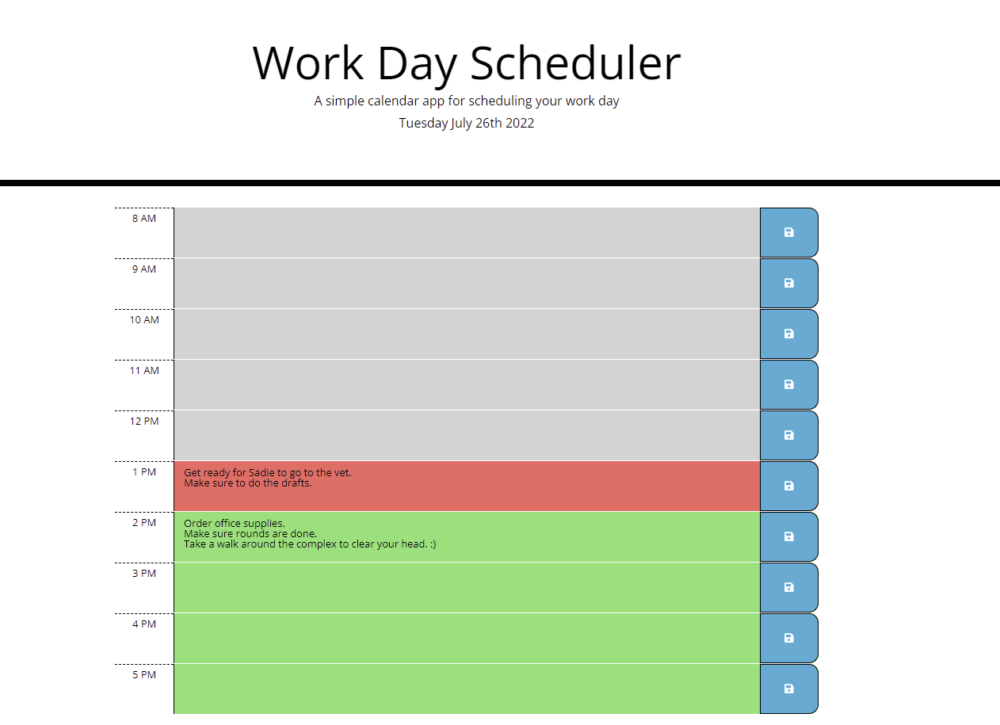

# Work_Day_Scheduler

## User Story

```
AS AN employee with a busy schedule
I WANT to add important events to a daily planner
SO THAT I can manage my time effectively
```
## Page Functionality
    Given an hourly calendar for the day when I load the page
    Stores data for each hour block
    Past time for the day is colored grey
    current hour is colored red
    future timeblocks are colored green
    Clicking the save icon saves the information to local storage
    When page is refreshed, daily items are retrieved from local storage
    


## Work

* The URL of the deployed application: https://rob-watson-84.github.io/Work_Day_Scheduler/

* The URL of the GitHub repository: https://github.com/Rob-Watson-84/Work_Day_Scheduler




---